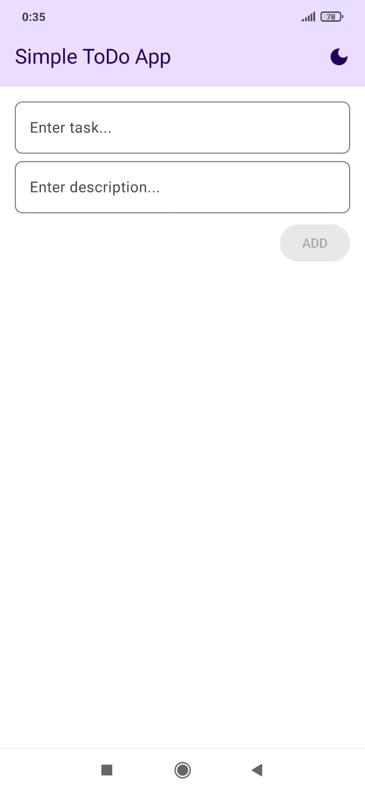
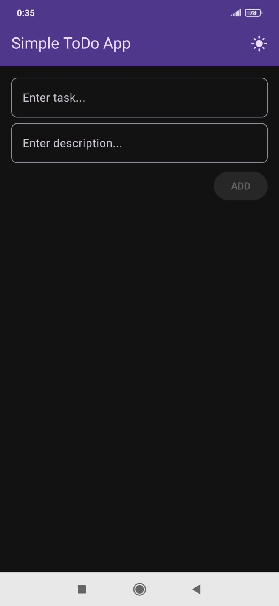
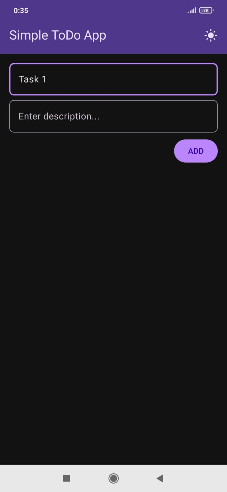
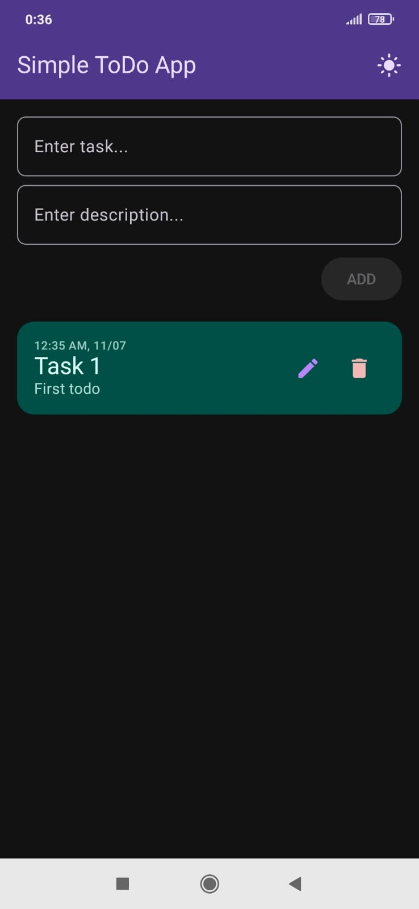
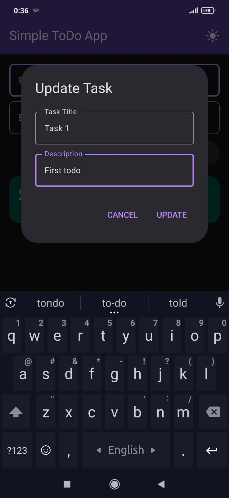

# ToDo App

A modern, lightweight Android application built with Jetpack Compose designed to help you manage your daily tasks efficiently. This app demonstrates the implementation of the MVVM architecture, Room database for persistent storage, and Material 3 design principles.

## Features

- **Task Management**: Easily add, edit, and delete tasks.
- **Detailed Tasks**: Each task supports both a title and an optional description.
- **Persistent Storage**: Uses Room Database to ensure your tasks are saved even after closing the app.
- **Theming**: Full support for Dark and Light modes with a seamless toggle in the UI.
- **Timestamps**: Automatically records and displays the creation time for every task.
- **Modern UI**: Built entirely with Jetpack Compose and Material 3 components for a smooth user experience.
- **Focus Management**: Intuitive focus clearing when tapping outside of input fields.

## Tech Stack

- **Language**: [Kotlin](https://kotlinlang.org/)
- **UI Framework**: [Jetpack Compose](https://developer.android.com/jetpack/compose)
- **Design System**: [Material 3](https://m3.material.io/)
- **Database**: [Room](https://developer.android.com/training/data-storage/room)
- **Architecture**: MVVM (Model-View-ViewModel)
- **Asynchronous Programming**: [Coroutines](https://kotlinlang.org/docs/coroutines-overview.html)
- **Data Observation**: LiveData

## Project Structure

```text
com.example.simple_todo_app
├── db/                # Database configuration, DAO, and Type Converters
├── MainActivity.kt    # Entry point of the application
├── MainApplication.kt # Application class for database initialization
├── Todo.kt            # Room Entity representing a task
├── TodoListPage.kt    # Main UI screen built with Compose
├── TodoViewModel.kt   # Business logic and data stream handling
└── ui/theme/          # Material 3 theme definitions (Color, Type, Theme)
```

## Getting Started

### Download APK
You can download the latest debug APK from the link below:
[**Download ToDo App APK**](./app/build/outputs/apk/debug/app-debug.apk)

### Prerequisites

- Android Studio Ladybug | 2024.2.1 or newer
- JDK 17 or higher
- Android SDK 26+ (Android 8.0 Oreo)

### Installation

1. Clone the repository:
   ```bash
   git clone https://github.com/shadman2503/SimpleToDoApp.git
   ```
2. Open the project in Android Studio.
3. Sync the project with Gradle files.
4. Run the app on an emulator or a physical device.

## Screenshots

### Main Interface
<p align="center">
  
  
</p>

### Task Management
<p align="center">
  
  
  
</p>

## Contributing

Contributions are welcome! If you have suggestions for improvements or new features, feel free to open an issue or submit a pull request.

## Developer

**Shadman Shoumik**
- GitHub: [@shadman2503](https://github.com/shadman2503)

## License

This project is licensed under the MIT License - see the [LICENSE](LICENSE) file for details.
